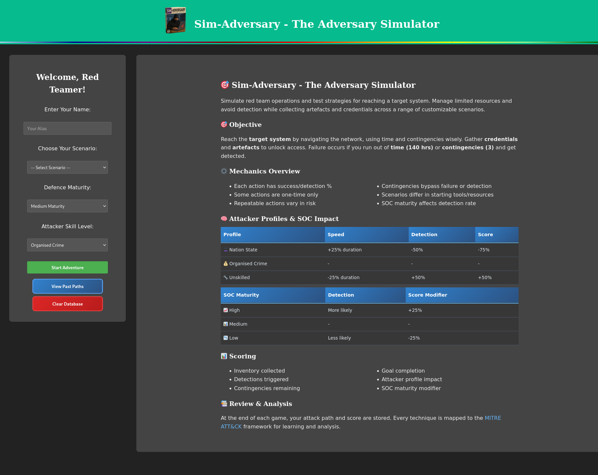

# Sim-Adversary Public Edition - Prism Infosec's Open Source Game Engine

A flexible cybersecurity training game engine for creating and running red team operation simulations. Build custom attack scenarios, manage resources, and provide hands-on learning experiences with MITRE ATT&CK framework integration.


## 🎯 Overview

Sim-Adversary is an open-source game engine designed to help cybersecurity educators and trainers create interactive attack simulation scenarios. The platform provides the framework for building choose-your-own-adventure style cybersecurity training experiences that map to the MITRE ATT&CK framework.

**This is a game engine - scenarios are created by the community!**

Original Theme - Classic


Themes can be customized using the brander.py tool in the tools directory.

### Key Features

- **Flexible Scenario Engine**: JSON-based scenario creation system
- **MITRE ATT&CK Integration**: Built-in support for technique mapping and documentation links
- **Configurable Difficulty**: Adjustable attacker skill levels and defence maturity settings
- **Resource Management System**: Time constraints, contingencies, and inventory management
- **Detection Simulation**: Realistic detection probability modelling
- **Path Analysis**: Detailed post-game analysis and scoring
- **Community-Driven**: Designed for community-created scenarios and events

### What's Included
- Complete game engine and user interface
- Template files for scenario creation
- Documentation for building custom scenarios
- Configurable game mechanics and scoring
- Database integration for progress tracking
- Theming system for customization

### What's Not Included
- Multiple Pre-built attack scenarios (create your own!)
- Specific training content (community-driven)
- Real vulnerability data or exploits

## 🚀 Quick Start

### Prerequisites

- Node.js (v14 or higher)
- npm or yarn package manager

### Installation

1. **Clone the repository**
   ```bash
   git clone https://github.com/PrismInfosecLabs/Sim-Adversary-Public.git
   cd Sim-Adversary-Public
   ```

2. **Run the setup script**
   ```bash
   chmod +x setup.sh
   ./setup.sh
   ```

3. **Start the application**
   ```bash
   npm start
   ```

4. **Access the game**
   - Open your browser to `http://localhost:3000`

### First Story and Events Included ###
We have included the phishing story path and some events to colour your experience in this release. This is so you have opportunity to see how we have structured an example scenario, so you can model your own stories after it!


### Creating Your First Scenario

1. **Read the scenario creation guide**: Check the documentation in `/public/game-data/template/`
2. **Copy the template**: Use the provided template files as your starting point
3. **Build your story**: Create interconnected JSON files for your attack scenario
4. **Test and iterate**: Play through your scenario and refine the experience
5. **Share with the community**: Contribute your scenarios back to the project

## 🎮 How the Game Engine Works

### Game Mechanics
- **Time Management**: Configurable starting hours, each action costs time
- **Detection System**: Probability-based detection with consequences
- **Resource System**: Contingencies to recover from failures and detections
- **Inventory Management**: Collect and use credentials, tools, and intelligence
- **Attempt Limiting**: Actions can become less effective with repeated use
- **Branching Narratives**: Multiple paths and outcomes based on player choices

### Scenario Framework
- **JSON-Based**: Easy-to-edit scenario files
- **Modular Design**: Individual rooms/steps with interconnected choices
- **Rich Metadata**: MITRE ATT&CK mapping, costs, risks, and rewards
- **Flexible Requirements**: Item dependencies and conditional actions
- **Configurable Balance**: Adjustable difficulty and success rates

### Player Progression
- Start scenarios with customizable initial resources
- Navigate through decision trees based on realistic attack patterns
- Manage limited resources while avoiding detection
- Receive detailed post-game analysis and scoring

## 🏗️ Architecture

### Backend Components
- **Express.js Server**: REST API and static file serving
- **Sequelize ORM**: Database operations with SQLite
- **Game Engine**: Core game logic and state management
- **Scenario Loader**: Dynamic loading of community-created scenarios
- **Scoring System**: Flexible scoring algorithm with modifiers

### Frontend Components
- **Game Controller**: Main game logic and flow management
- **UI Framework**: Responsive interface for various devices
- **Inventory Manager**: Item and credential tracking
- **Testing System**: Simulates security tool usage and challenges
- **Path Analyzer**: Game history visualization and learning tools

### Database Schema
```sql
GamePath {
  id: INTEGER PRIMARY KEY
  player: STRING
  scenario: STRING
  skillLevel: STRING
  defenseMaturity: STRING
  won: BOOLEAN
  timestamp: STRING
  score: STRING
  path: TEXT (JSON)
  createdAt: DATETIME
  updatedAt: DATETIME
}
```

## 📊 Scenario Creation System

### File Structure
Each scenario consists of:
- **start-here.json**: Entry point with initial setup
- **Room files**: Individual decision points in the attack chain
- **Choice definitions**: Available actions with costs, risks, and requirements
- **Reward system**: Items, credentials, or access gained from actions
- **Flow control**: Transitions between different stages

### MITRE ATT&CK Integration
Built-in support for:
- Technique IDs (T1234, T1234.001)
- Automatic links to MITRE ATT&CK documentation
- Educational context and technique descriptions
- Realistic success/detection probability modelling

### Customization Options
- Adjustable time costs and success rates
- Configurable detection probabilities
- Custom item and reward systems
- Branching storylines and multiple endings
- Special test scenarios and challenges

## 🔧 Development & Customization

### Project Structure
```
PriSim-Adversary-Public/
├── CONTRIBUTING.MD
├── LICENSE
├── README.md
├── server.js              # Express server
├── database.js            # Database configuration
├── routes.js              # API routes
├── setup.bat              # Windows setup
├── setup.sh               # Unix setup
├── models/
│   └── GamePath.js        # Database model
├── public/
│   ├── game-data/
│   │   └── template/      # Scenario templates and documentation
│   ├── events/            # Random game events
│   ├── *.js               # Frontend modules
│   ├── index.html         # Main interface
│   └── style.css          # Styling
├── tools/
│   └── brander.py         # Theme customization tool
└── package.json
```

### Adding Scenarios
1. Create new folder in `public/game-data/`
2. Build scenario using provided templates
3. Update `index.html` scenario dropdown
4. Configure metadata in `gameConfig.js`
5. Test all possible paths thoroughly

### Customizing Game Balance
Edit `gameConfig.js` to modify:
- Starting resources (hours, contingencies)
- Skill level impact modifiers
- Defense maturity effects
- Scoring algorithm weights
- Special item bonuses and penalties

### Creating Themes
Use the `tools/brander.py` script to:
- Generate custom color schemes
- Modify UI elements and styling
- Create organization-specific branding
- Customize logos and imagery

## 🧪 Testing & Quality Assurance

### Scenario Testing
- Verify all paths are reachable
- Test item dependencies and requirements
- Validate MITRE ATT&CK links
- Check JSON syntax and structure
- Balance difficulty and learning objectives

### Engine Testing
- Cross-browser compatibility
- Database operation validation
- Scoring calculation verification
- UI responsiveness testing
- Performance optimization

## 📈 Educational Value & Analytics

### Learning Outcomes
- Understanding attack progression and tactics
- Resource management under pressure
- Consequence-based decision making
- MITRE ATT&CK framework familiarity
- Red team methodology appreciation

### Post-Game Analysis
- Detailed attack path visualization
- MITRE technique usage mapping
- Resource utilization efficiency
- Detection avoidance performance
- Comparative scoring and improvement tracking

## 🤝 Community & Contributing

### We Need Your Help!
This project thrives on community contributions:
- **Scenario Creators**: Build realistic attack simulations
- **Educators**: Share training methodologies and feedback
- **Developers**: Enhance the game engine and features
- **Security Professionals**: Provide realistic attack patterns

### Contributing Guidelines
1. Fork the repository
2. Create scenarios following the template structure
3. Test thoroughly across all paths
4. Document any new features or mechanics
5. Submit pull requests with clear descriptions

### Contribution Types
- **New Scenarios**: Attack simulations for different industries/environments
- **Game Events**: Random events that add realism and challenge
- **Engine Improvements**: Performance, features, and usability enhancements
- **Documentation**: Tutorials, guides, and educational materials
- **Themes**: Visual customizations and branding options

## 🛡️ Security & Ethics

### Educational Purpose
This platform is designed exclusively for:
- Cybersecurity education and training
- Understanding attack methodologies
- Improving defensive strategies
- Ethical hacking skill development

### Responsible Use
- No real vulnerability exploitation
- Simulated environments only
- No actual network attacks or scanning
- Respect all applicable laws and regulations

## 📄 License

This project is licensed under the MIT License - see the [LICENSE](LICENSE) file for details.

## 🙏 Acknowledgments

- [MITRE ATT&CK Framework](https://attack.mitre.org/) for comprehensive technique documentation
- Cybersecurity education community for feedback and requirements
- Red team practitioners for authentic attack pattern insights
- Open source contributors who make this project possible

## 📞 Support & Community

- **Issues**: Report bugs and request features via GitHub Issues
- **Discussions**: Join community conversations for scenario ideas and improvements
- **Documentation**: Comprehensive guides available in the `/docs` folder
- **Examples**: Reference implementations in the `/public/game-data/template/` directory

### Getting Started Resources
1. **Scenario Creation Guide**: Complete walkthrough for building your first scenario
2. **Template Files**: Ready-to-use starting points for common attack types
3. **Best Practices**: Guidelines for effective cybersecurity training design

---

**Join the Community**: Help build the future of hands-on cybersecurity education. Your scenarios and contributions make this platform valuable for learners worldwide.

**Disclaimer**: This tool is for educational and training purposes only. Use responsibly and in accordance with all applicable laws and organizational policies.
